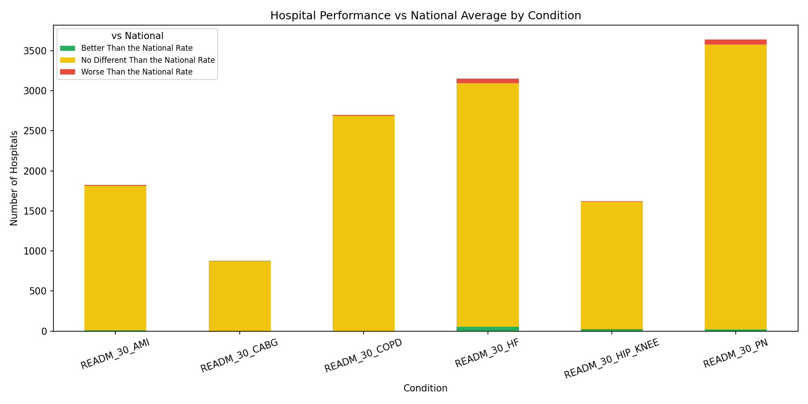
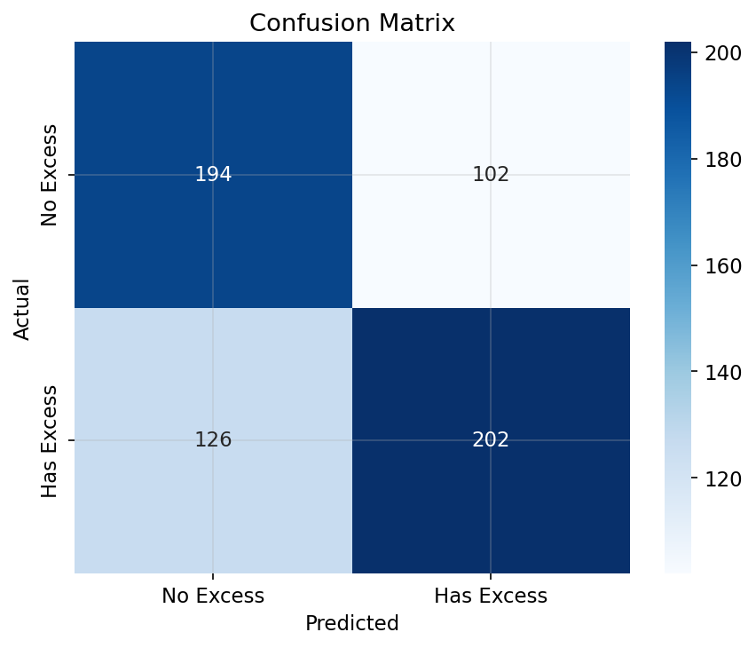
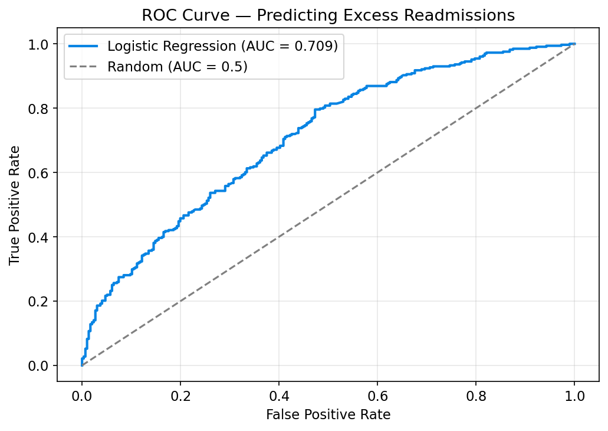
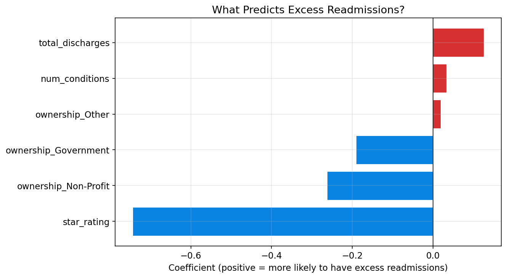

# Hospital Readmission Penalties: Who's Losing Money and Why?

## Problem Statement
Medicare penalizes hospitals up to 3% of their total payments if too many patients get readmitted within 30 days of discharge through the Hospital Readmissions Reduction Program (HRRP). This costs hospitals millions of dollars annually.

I analyzed 3 real CMS government datasets covering 3,055 hospitals to find out which hospitals are getting hit the hardest, what conditions drive the most excess readmissions, and whether factors like ownership type and star ratings predict readmission performance — backed by statistical testing and predictive modeling.

## Key Findings (TL;DR)
- **For-profit hospitals have significantly worse readmission rates** than non-profits (ERR 1.0174 vs 0.9984, t-test p ≈ 0)
- **Star rating strongly predicts readmission performance** (Spearman r = -0.22, p < 0.001) — 1-star hospitals avg ERR ~1.04, 5-star hospitals ~0.97
- **Hip/Knee replacement** unexpectedly had the highest avg ERR despite being an elective procedure
- **~48% of hospitals** exceed expected readmission rates for any given condition
- A **logistic regression model** predicts excess readmissions with 63.5% accuracy (AUC 0.709) using only hospital characteristics — star rating is the strongest predictor

## Data Sources
All data from [data.cms.gov](https://data.cms.gov) — real government data, not synthetic.

| Dataset | Link | What it has |
|---------|------|-------------|
| HRRP | [9n3s-kdb3](https://data.cms.gov/provider-data/dataset/9n3s-kdb3) | Excess readmission ratios by condition per hospital |
| Unplanned Hospital Visits | [632h-zaca](https://data.cms.gov/provider-data/dataset/632h-zaca) | Actual readmission rates, national benchmarks |
| Hospital General Info | [xubh-q36u](https://data.cms.gov/provider-data/dataset/xubh-q36u) | Hospital type, ownership, star ratings, location |

## Methodology

### SQL — Data Cleaning & Joining
- Loaded 3 CSV files into SQLite
- CMS data was messy: `None` values in numeric columns, `"Not Available"` and `"Too Few to Report"` strings mixed with real numbers, 14 different measure types in one file when I only needed 6
- Used CASE statements to convert messy values to NULL, cast text to numeric types
- Filtered unplanned visits to only the 6 HRRP readmission measures
- Joined hospital info + HRRP data on Facility ID → 3,055 hospitals, 18,330 rows

### Python — Analysis, Statistical Testing & Visualization
- Analyzed excess readmission ratios by condition, ownership type, star rating, and state
- **T-test** to verify the for-profit vs non-profit difference is statistically significant
- **Pearson and Spearman correlations** for star rating vs ERR and hospital size vs ERR
- Identified "worst offender" hospitals failing on 4+ conditions
- 11 visualizations with consistent styling

### Predictive Modeling — Logistic Regression
- Built a logistic regression to predict whether a hospital will have excess readmissions (ERR > 1.0)
- Features: star rating, total discharges, number of conditions measured, ownership type
- Trained on 1,870 hospitals, tested on 624
- **Results: 63.5% accuracy, AUC-ROC 0.709**
- Star rating was the strongest predictor (coefficient: -0.744), followed by non-profit ownership (-0.262)
- The model confirms that hospital characteristics independently predict readmission performance, not just correlate with it

## Visualizations

### Conditions Driving Excess Readmissions


### Star Rating vs Readmission Performance


### Ownership Type Comparison


### Top States by ERR


### ERR Distribution by Condition


### Performance vs National Average


### Number of Failing Conditions per Hospital


### Hospital Size vs Readmission Performance


### Predictive Model — Confusion Matrix


### Predictive Model — ROC Curve


### Predictive Model — Feature Importance


## How to Run

```bash
git clone https://github.com/athulyabiju23/hospital-readmission-analysis.git
cd hospital-readmission-analysis

python -m venv venv
source venv/bin/activate
pip install -r requirements.txt

# download the 3 CSVs from data.cms.gov and put them in data/raw/

# run main analysis first (creates the SQLite database)
jupyter notebook hospital_readmission_analysis.ipynb

# then run predictive modeling
jupyter notebook predictive_analysis.ipynb
```

## Project Structure
```
hospital-readmission-analysis/
├── data/
│   ├── raw/                     # 3 CMS CSV files (download from cms.gov)
│   └── processed/               # cleaned merged CSVs
├── sql/
│   ├── 01_exploration.sql       # data quality checks
│   ├── 02_clean_data.sql        # handling messy CMS values
│   └── 03_join_and_analysis.sql # joins + analysis queries
├── charts/                      # all generated visualizations
├── hospital_readmission_analysis.ipynb   # main analysis
├── predictive_analysis.ipynb             # logistic regression
├── requirements.txt
├── .gitignore
└── README.md
```

## Tools Used
- **SQL** (SQLite) — data cleaning, joins, aggregations
- **Python** (pandas, matplotlib, seaborn, scipy, scikit-learn) — analysis, statistical testing, predictive modeling, visualization

## What I'd Improve
- Add year-over-year trend analysis — are the same hospitals getting penalized repeatedly?
- Include patient demographic data (poverty rates, insurance mix) as additional features in the predictive model
