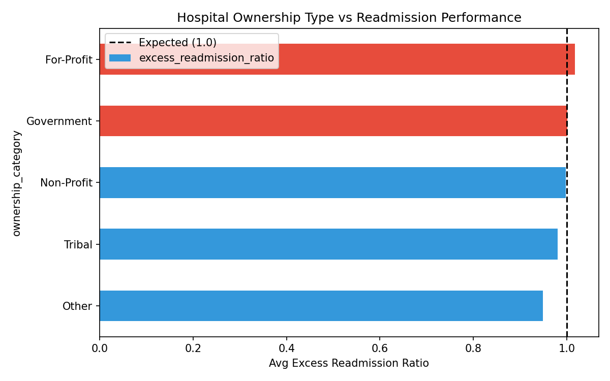
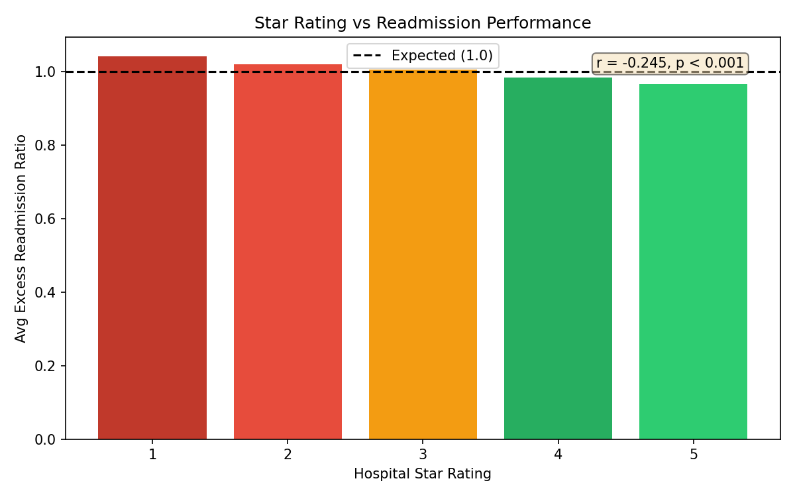
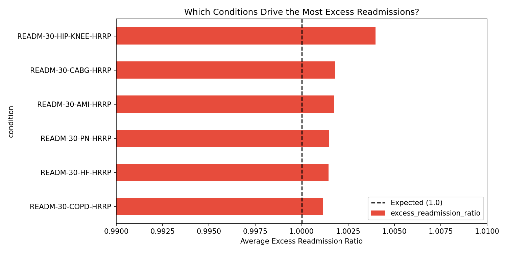
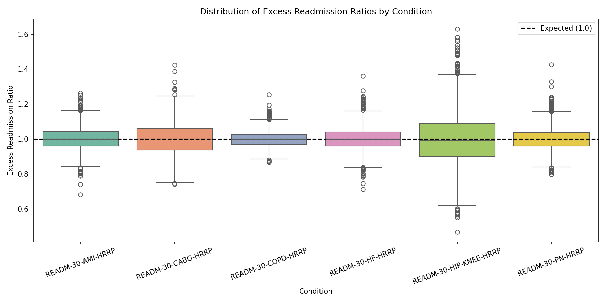
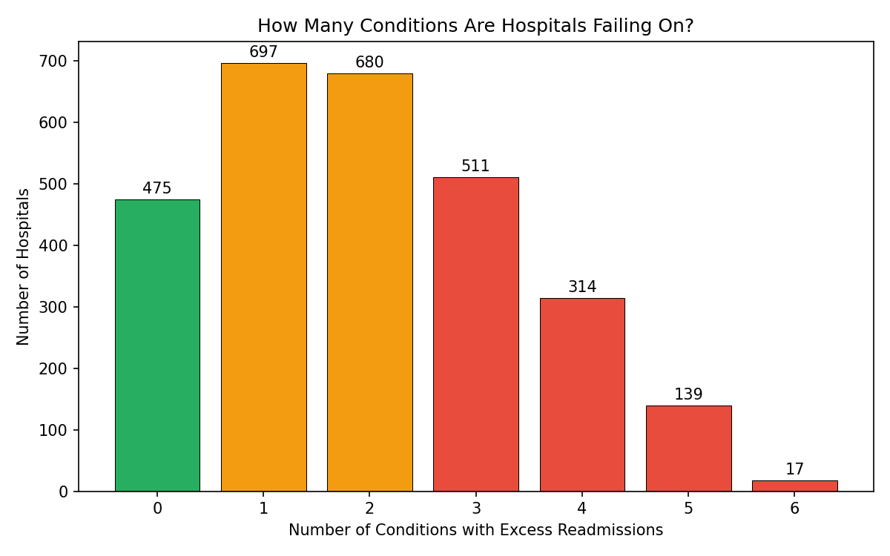
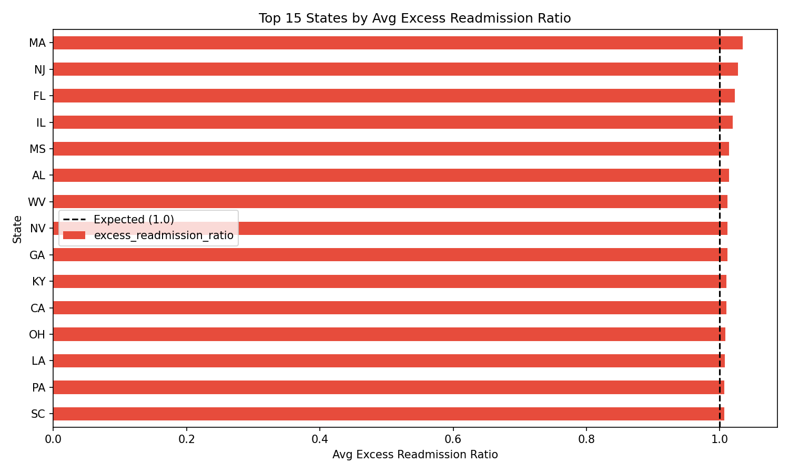
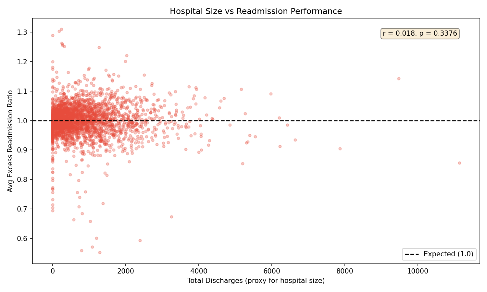

# Hospital Readmission Penalties: Who's Losing Money and Why?

## Problem Statement
Medicare penalizes hospitals up to 3% of their payments if too many patients get readmitted within 30 days of discharge through the Hospital Readmissions Reduction Program (HRRP). I analyzed real CMS government data to figure out which hospitals are getting hit the hardest, what conditions drive the most penalties, and whether things like ownership type or star ratings make a difference.

If a hospital administrator looked at this analysis, they'd know which conditions to prioritize for improvement, whether their ownership type puts them at higher risk, and how their star rating relates to readmission performance.

## Data Sources
All data downloaded from [data.cms.gov](https://data.cms.gov) — real government data, not synthetic.

| Dataset | Link | What it has |
|---------|------|-------------|
| HRRP | [9n3s-kdb3](https://data.cms.gov/provider-data/dataset/9n3s-kdb3) | Excess readmission ratios by condition for each hospital |
| Unplanned Hospital Visits | [632h-zaca](https://data.cms.gov/provider-data/dataset/632h-zaca) | Actual readmission rates, national benchmarks, comparison flags |
| Hospital General Info | [xubh-q36u](https://data.cms.gov/provider-data/dataset/xubh-q36u) | Hospital type, ownership, star ratings, location |

## Methodology

### SQL — Data Cleaning & Joining
- Loaded 3 CSV files into SQLite database
- The CMS data was messy: `None` values in numeric columns, `"Not Available"` strings mixed with real numbers, 14 different measure types in one file when I only needed 6
- Used CASE statements to convert `"Not Available"` to NULL and cast text columns to numeric types
- Filtered unplanned visits to only the 6 HRRP readmission measures (the file also had ED visits, excess days in acute care, etc)
- Joined hospital info + HRRP data on Facility ID using INNER JOIN — ended up with 3,055 hospitals and 18,330 rows (6 conditions per hospital)

### Python — Analysis & Visualization
- Analyzed excess readmission ratios by condition, ownership type, star rating, state
- Identified "worst offender" hospitals failing on multiple conditions
- Built 8 visualizations covering all the key findings

## Key Findings

### 1. For-profit hospitals have the highest excess readmission ratios
For-profit hospitals averaged an ERR of **1.0174** compared to non-profits at **0.9984** and government hospitals at **1.0012**. For-profits were the only ownership category meaningfully above the expected threshold.



### 2. Clear relationship between star rating and readmissions
1-star hospitals had an avg ERR of **1.0415** while 5-star hospitals were at **0.9661**. The gradient is consistent across all 5 rating levels.



### 3. Hip/Knee replacement surprisingly had the highest avg ERR
At **1.0040**, Hip/Knee had the highest average excess readmission ratio. This was unexpected since it's an elective procedure where you'd think hospitals have more control over outcomes.



### 4. ~48% of hospitals have excess readmissions for any given condition
Across all conditions, roughly half of hospitals have ERR > 1.0.



### 5. Some hospitals are failing on all 6 conditions
AdventHealth Orlando had the worst performance among hospitals failing all 6 measured conditions, with an avg ERR of **1.1426**.



### 6. State-level variation exists
Some states consistently have higher excess readmission ratios than others.



### 7. Hospital size doesn't strongly predict readmission performance
The correlation between total discharges and avg ERR was weak, suggesting smaller and larger hospitals can both have readmission issues.



## How to Run

```bash
# clone the repo
git clone https://github.com/athulyabiju23/hospital-readmission-analysis.git
cd hospital-readmission-analysis

# create virtual env and install dependencies
python -m venv venv
source venv/bin/activate
pip install -r requirements.txt

# download the 3 CSVs from data.cms.gov and put them in data/raw/
# then open the notebook
jupyter notebook hospital_readmission_analysis.ipynb

# run all cells — it loads data into sqlite, cleans, joins, analyzes, and generates charts
```

## Project Structure
```
hospital-readmission-analysis/
├── data/
│   ├── raw/                     # 3 CMS CSV files (not in repo, download from cms.gov)
│   └── processed/               # cleaned merged data exported for Tableau
├── sql/
│   ├── 01_exploration.sql       # data quality checks
│   ├── 02_clean_data.sql        # handling messy CMS values
│   └── 03_join_and_analysis.sql # joins + analysis queries
├── charts/                      # all generated visualizations
├── hospital_readmission_analysis.ipynb  # main analysis notebook
├── requirements.txt
├── .gitignore
└── README.md
```

## Tools Used
- **SQL** (SQLite) — data cleaning, joins, aggregations, exploration
- **Python** (pandas, matplotlib, seaborn) — analysis and visualization
- **Tableau** — interactive dashboard (in progress)

## What I'd Improve
- Add the payment reduction percentage data — the HRRP file I downloaded had ERR but not the actual penalty amounts
- Run a logistic regression to predict which hospitals are likely to have excess readmissions based on ownership, size, location
- Add year-over-year trend analysis since CMS publishes this data annually
- Include demographic data (poverty rates, insurance mix) as potential confounders
- Use hospital bed count as a better size proxy than total discharges
